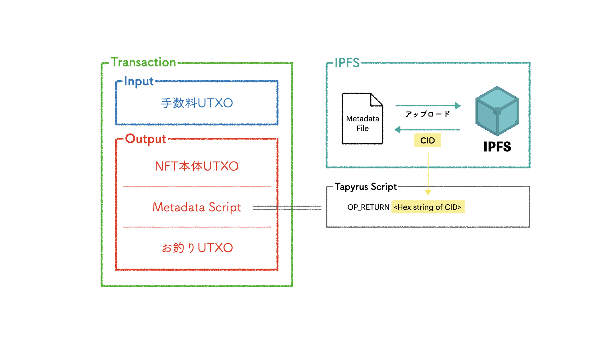

# Tapyrus Token with Metadata Sample

[Tapyrus Token にメタデータを付与 - shmn7iii blog](https://blog.shmn7iii.net/tapyrus-token-metadata)

### Sample of issuing token with metadata on Tapyrus.

Tapyrus でメタデータを付与したトークンを発行するサンプル。OP_RETURN の後ろに任意データを仕込んだスクリプトを持つアウトプットを発行トランザクションに捩じ込むことでオンチェーンでのメタデータ付与を実現した。また OP_RETURN の後ろに入れるデータも IPFS の CID にすることであらゆる容量、ファイル形式のデータを格納することが可能になっている。



[Tap!](https://github.com/shmn7iii/tap-api) で行った実装の切り出し。

## spec

Ruby: 3.1.2  
Rails: 7.0.1.2

## setup

required: nodejs, yarn, docker, docker-compose

```bash
# setup bundle, database, and so on.
$ ./bin/setup

# start containers. this include tails, tapyrusd, ipfs.
$ docker-compose up
```

Go [localhost:3000](localhost:3000)
